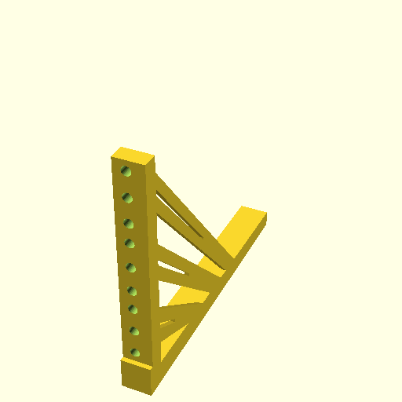

# 3d-rack-brackets

Learning project for 3d modelling using [OpenSCAD](https://openscad.org/) and [GhostSCAD](https://github.com/ljanyst/ghostscad/).

## Usage

```sh
devbox shell

# To get the openscad code:
devbox run render:prod

# or to get the stl:
devbox run render:stl
```

Now there's [output](./output/output.scad).

## Watching the code to rebuild the 3d model
```sh
devbox shell
devbox run watch
```

Now you can edit the code and on every change the output file is re-rendered.

## Development
If you want to make contributions, please first talk to me.

### Dev setup
This project is built using [devbox](https://www.jetify.com/devbox) to manage its build chain. I strongly recommend you use it for this project (but also in general).
Run `devbox run shell` to start a reproducible environment containing all the tools you need to build and test this project.

Assuming you like neovim and tmux, you can run `devbox run dev` to start a tmux session after my tastes.

### Building the executable
```sh
# First setup the devbox environment to install the right compiler version etc.
devbox run shell

# Then build the executable
devbox run build
```

## Preview

Currently looks like this:


